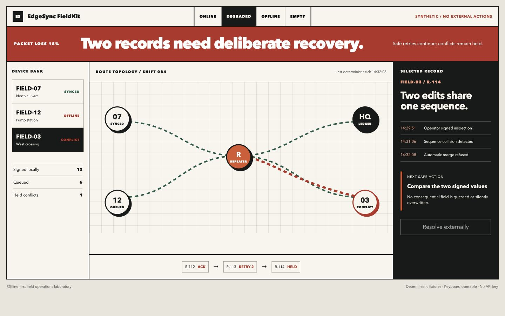
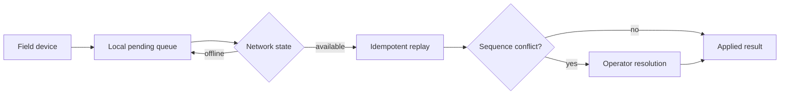

# EdgeSync FieldKit

**Offline-first synchronization for synthetic field inspection teams.**

> All people, organizations, records, measurements, and outcomes in this
> repository are synthetic.



[Open the live demonstration](https://jermaine-anugwom.github.io/edgesync-fieldkit/)

## Run it locally

Requires Git and Docker with Compose v2. Initial setup downloads dependencies and images; no model key is needed.

```bash
git clone https://github.com/Jermaine-Anugwom/edgesync-fieldkit.git
cd edgesync-fieldkit
docker compose up --build
```

Open the [interface](http://127.0.0.1:3002) or [API documentation](http://127.0.0.1:8002/docs).
The interface replays a static synthetic fixture alongside the API; it is not API-produced evidence.

## The operational problem

Field work must continue through unreliable connectivity without duplicate actions, lost evidence, or silent conflicts.

## The proof

Deterministic offline queuing, content-addressed event IDs, suppression of previously seen events, and conflict detection for divergent same-sequence edits within a synchronization batch.

## Why this is forward deployed

The project begins with the operator's decision, uncertainty, failure cost,
integration boundary, and handoff—not with a model demo. It makes policy and
evidence inspectable, preserves human authority for consequential cases, and
remains useful when the optional model layer is unavailable.

## Architecture



## Python-only setup

From the cloned repository, with Python 3.12 installed:

```bash
python3.12 -m venv .venv
source .venv/bin/activate
python -m pip install -c constraints.txt -e '.[dev]'
pytest -q
edgesync
```

The API uses local synthetic data. Dependency installation requires a network connection; running the demonstration needs no model key.

## Evaluation and limitations

Run `pytest -q` for the reproducible evaluation. The fixture set is deliberately
synthetic and cannot establish production performance. A real deployment would
require operator observation, representative data, policy review, privacy review,
security testing, and a monitored rollout.

## Project documents

- [Field discovery and handoff](FIELD_NOTES.md)
- [Security boundaries](SECURITY.md)
- [Operating runbook](RUNBOOK.md)
- [Development provenance](DEVELOPMENT.md)
- [Release history](CHANGELOG.md)

## Topics

`offline-first`, `field-operations`, `fastapi`, `nextjs`, `distributed-systems`, `resilience`
